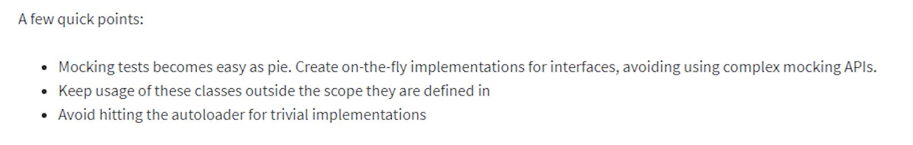

# PHP Object-Oriented Programming (OOP) Learning

This branch was created to document everything I learn about OOP in PHP.

---

## 📚 Table of Contents

- [Classes & Objects](#classes--objects)
- [Constructor Method](#constructor-method)
- [Creating Objects Using Variables](#creating-objects-using-variables)
- [Destructor](#destructor)
- [Constructor Property Promotion](#constructor-property-promotion)
- [Null-safe Operator](#null-safe-operator)
- [Namespaces](#namespace)
- [Autoload](#auto-load)
- [PHP-FIG & PSR](#php-fig)
- [Composer Autoloading](#using-composer-for-autoload)
- [Scope Resolution Operator (::)](#scope-resolution-operator-)
- [Class Constants](#class-constants)
- [Static Members](#static)
- [Inheritance](#inheritance)
- [Polymorphism](#polymorphism)
- [Abstraction](#class-abstraction)
- [Interfaces](#object-interfaces)
- [Magic Methods](#magic-methods)
- [Late Static Binding](#late-static-binding)
- [Traits](#traits)
- [Anonymous Classes](#anonymous-classes)

---

## Classes & Objects

It is recommended to create one file per class and name each file after its class.

Class variables are called **properties**, and functions inside a class are called **methods**.

Use the object operator `->` to access an object’s properties and methods.

If a property is declared with a type but not initialized, it shows up as `uninitialized(type)`:

```php
public float $amount;
public string $description;
```

Output:

```php
object(Transaction)#1 (0) {
  ["amount"]=>
  uninitialized(float)
  ["description"]=>
  uninitialized(string)
}
```

You can return the current object from a method by typing the class name as the return type:

```php
public function applyDiscount(float $rate): Transaction {
    $this->amount -= $this->amount * $rate / 100;
    return $this;
}
```

This allows **method chaining**:

```php
$transaction = new Transaction(100, "Description")
    ->addTax(5)
    ->applyDiscount(10);
```

You can also discard the object after calling methods:

```php
$amount = (new Transaction(100, "Description"))
    ->addTax(5)
    ->applyDiscount(10)
    ->getAmount();
```

## Constructor Method

The constructor is a method automatically called when a new instance is created. Always declare visibility (public/private/protected) explicitly.

```php
public function __construct(float $amount, string $description) {
    $this->amount = $amount;
    $this->description = $description;
}
```

## Creating Objects Using Variables

```php
$class = 'Transaction';
$transaction = new $class(15, 'Description');
```

## Destructor

The destructor method is called when there are no more references to the object, or explicitly with `unset()`.

```php
public function __destruct() {
    echo '<br> Destruct ' . $this->description . '<br>';
}
```

## Constructor Property Promotion

Using property promotion simplifies your constructor by defining and initializing properties in one line:

```php
public function __construct(
    private float $amount,
    private string $description
) {}
```

## Null-safe Operator

The null-safe operator `?->` avoids errors when accessing properties/methods on potentially null objects.

```php
$country = $session?->user?->getAddress()?->country;
```

## Namespace

Namespaces avoid name collisions between classes with the same name.

```php
namespace PaymentGateway\Stripe;
```

Access classes using their fully qualified name or with `use` statements:

```php
use PaymentGateway\Stripe\Transaction;
```

Access PHP built-in classes from within a namespace with `\`:

```php
$datetime = new \DateTime();
```

You can also alias class names:

```php
use PaymentGateway\Stripe\Transaction as StripeTransaction;
```

Use `var_dump(\explode(',', 'hello,world'))` to avoid potential bugs.

## Auto Load

Register an autoloader function using `spl_autoload_register()`:

```php
spl_autoload_register(function($class) {
    $path = __DIR__ . '/../' . lcfirst(str_replace('\\', '/', $class)) . '.php';
    require $path;
});
```

## PHP-FIG

[PHP-FIG](https://www.php-fig.org/) is responsible for defining PSR standards to ensure consistency across PHP libraries and frameworks.

Notable example: [PSR-12](https://www.php-fig.org/psr/psr-12/) for coding standards.

## Using Composer for Autoload

Composer autoloads classes from the `vendor` directory. Add this to your `composer.json`:

```json
{
    "autoload": {
        "psr-4": {
            "App\\": "app/"
        }
    }
}
```

Then run:

```bash
composer dump-autoload -o
```

Include in your `index.php`:

```php
require __DIR__ . '/../vendor/autoload.php';
```

## Scope Resolution Operator (::)

Used to access class constants, static properties, and static methods.

```php
echo Transaction::STATUS_PAID;
```

## Class Constants

Constants are shared across instances and accessed statically.

```php
class Transaction {
    const STATUS_PAID = 'paid';
}
```

## Static

Static methods and properties belong to the class, not an instance.

```php
class Transaction {
    private static int $count = 0;

    public static function getCount(): int {
        return self::$count;
    }
}
```

## Inheritance

Use `extends` to inherit from a base class.

```php
class B extends A {}
```

Use `parent::__construct()` to call the parent constructor. Use `final` to prevent overriding a class or method.

## Polymorphism

Polymorphism allows multiple classes to implement the same interface or extend the same base class, enabling interchangeable objects.

## Class Abstraction

Abstract classes define base functionality and force child classes to implement specific methods.

```php
abstract class PaymentMethod {
    abstract public function process();
}
```


## Object Interfaces

Interfaces define a contract that implementing classes must follow.

```php
interface LoggerInterface {
    public function log(string $message): void;
}
```

Use interfaces when multiple implementations are expected.


## Magic Methods

- `__toString()` – Defines how the object should be converted to a string.
- `__invoke()` – Allows calling the object as a function.
- `__debugInfo()` – Customizes output when `var_dump()` is used.

## Late Static Binding

Late static binding lets static methods and properties reference the called class instead of the class they are defined in.

[Late Static Bindings](https://www.php.net/manual/en/language.oop5.late-static-bindings.php)

## Traits

Traits are used to reuse code in multiple classes.

```php
trait LoggerTrait {
    public function log(string $msg) {
        echo $msg;
    }
}

class MyClass {
    use LoggerTrait;
}
```

## Anonymous Classes

Useful for short-lived classes or one-off objects:

```php
$logger = new class {
    public function log($msg) {
        echo $msg;
    }
};
```



---

This documentation serves as a study guide and personal reference for learning Object-Oriented Programming in PHP.

