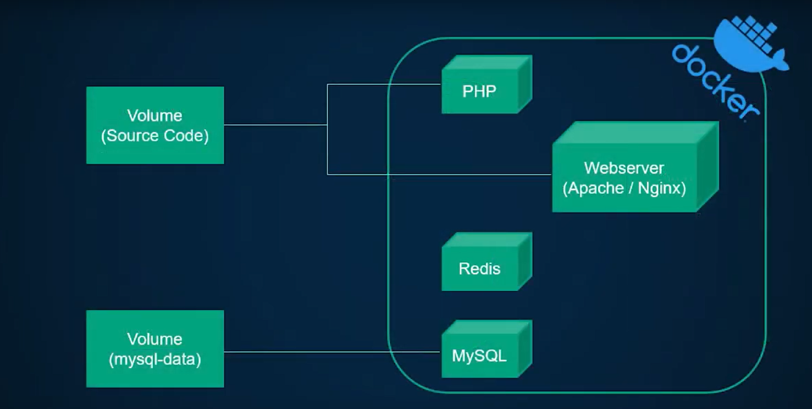

# Docker

This branch was created to document everything I’m learning about Docker with PHP.

---

## 📚 Table of Contents

---

## Comparison with XAMPP

XAMPP lacks many features and is not suitable for production use. This can lead to problems when your development environment differs from the production environment — what works locally might not work in production, and vice versa.

With Docker, you can ensure your local development environment closely matches the production setup.

Docker also allows you to work on multiple projects at the same time, even if they require different PHP versions.

It lets you bundle your development environment into isolated, portable containers.

You can have separate containers for the web server, PHP, database, etc.

Decoupling these services is beneficial because you can easily swap out containers individually, instead of dealing with a single, all-in-one environment.

A Docker container starts as a simple, minimal Linux machine with nothing installed by default for your application.

In the Dockerfile, you write instructions on how to build a Docker image. A Docker image is a **read-only executable package** that includes everything needed to run your application.

Images are considered templates — you can't run an image directly, but you can use it as a base to create containers.

### Running Multiple Containers Simultaneously

A `docker-compose.yml` file manages multiple containers in a simple and unified way.
