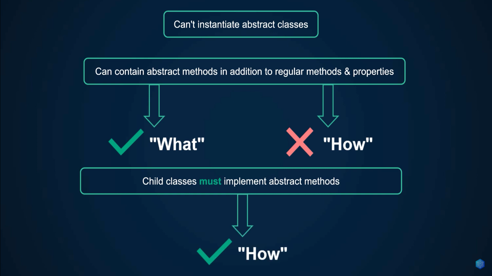
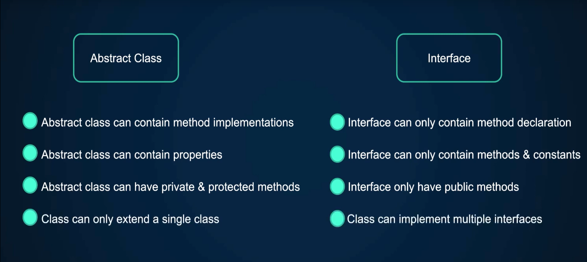

# PHP Object Oriented Programming Learning

This branch was created to document everything I learn about OOP PHP.

---

## 📚 Table of Contents

---

## Classes & Objects

É recomendado criar um arquivo para cada classe e nomeá-las sempre com o nome do arquivo

Variáveis das classes são chamadas de propriedades e funções são chamadas de métodos

O object operator é o seguinte: `->`, é com ele que é possível acessar as propriedades e métodos de um objeto.

A propriedade cujo nenhum valor foi setado e foi definida com algum tipo terá o tipo "uninitialized(typename)", ex:

```php
public float $amount;
public string $description;
```

Output:

```javascript
object(Transaction)#1 (0) {
  ["amount"]=>
  uninitialized(float)
  ["description"]=>
  uninitialized(string)
}
```

É possível colocar como retorno de um método o nome da classe, assim o método vai retornar o próprio objeto que o chamou.

```php
public function applyDiscount(float $rate): Transaction
{
    $this->amount -= $this->amount * $rate / 100;

    return $this;
}
```

Com isso pode-se aplicar o "method chaining":

```php
$transaction = new Transaction(100, "descrição")
->addTax(5)
->applyDiscount(10);

//O objeto é instanciado e já chama o método addTax e o applyDiscount é chamado para o objeto retornado desse método
```

É possível também instanciar um objeto, chamar os métodos necessários e logo depois pegar o valor, "descartando" o objeto:

```php
$transaction = new Transaction(100, "descrição")
->addTax(5)
->applyDiscount(10);
->getAmount();
```

## Constructor method

O método construtor é um método que é chamado sempre que é criada uma instância do objeto, é recomendado sempre colocar qual o modificador de acesso daquele método ou propriedade, por padrão, caso não escreva o modificador de acesso o php assume que seja public, mas não é bom deixar sem:

```php
public function __construct(float $amount, string $description)
{
    $this->amount = $amount;
    $this->description = $description;
}
```

## Criando objetos usando variáveis

```php
$class = 'Transaction';
$amount = new $class(15, 'descrição');
```

## Destructor

O método destrutor é chamado quando não há mais referência para o objeto ou quando o objeto é destruído.

```php
public function __destruct()
{
    echo '<br> Destruct ' . $this->description . '<br>';
}
```

```php
$class = 'Transaction';
$transaction = (new $class(15, 'Transaction 1'))
    ->addTax(20)
    ->applyDiscount(15);

$amount = $transaction->getAmount();

var_dump($amount);

//Output:
// float(15.3)
// Destruct Transaction 1

```

Se usar a função `unset($transaction)`, o destrutor também será chamado e o objeto destruído.

## Constructor Property Promotion

Ao colocar o especificador de acesso na chamada do construtor, não é necessário criar a propriedade na criação da classe e nem atribuir valor a propriedade com o `$this`, o construtor já cria a propriedade e ela já é atribuída o valor que foi recebido

isso é chamado de "property promotion"

```php
public function __construct(
    private float $amount,
    private string $description
) {

}
```

## Null-safe operator

The null-safe operator allows reading the value of property and method return value chaining, where the null-safe operator short-circuits the retrieval if the value is null, without causing any errors.

The syntax is similar to the property/method access operator (->), and following the nullable type pattern, the null-safe operator is ?->.

```php
$country =  null;

if ($session !== null) {
    $user = $session->user;

    if ($user !== null) {
        $address = $user->getAddress();

        if ($address !== null) {
            $country = $address->country;
        }
    }
}
```

With the nullsafe operator ?-> this code could instead be written as:

```php
$country = $session?->user?->getAddress()?->country;
```

## Namespace

Se dar um require em duas classes que tem o mesmo nome e não ser um namespace, significado que elas estão no global space, vai causar um erro:

```php
require_once '../PaymentGateway/Stripe/Transaction.php';
require_once '../PaymentGateway/Paddle/Transaction.php';
//output: Fatal error: Cannot declare class Transaction, because the name is already in use in...
```

Namespace servem para corrigir isso, namespace são como se fossem estrutura de diretórios virtuais para as suas classes

Podemos declarar um namespace escrevendo `namespace` no topo do arquivo, antes de qualquer código e depois de um declare statement

É recomendado combinar o nome do namespace com a estrutura do arquivo:

```php
namespace PaymentGateway\Paddle;
namespace PaymentGateway\Stripe;
```

```php
require_once '../PaymentGateway/Paddle/Transaction.php';
require_once '../PaymentGateway/Stripe/Transaction.php';

$paddleTransaction = new PaymentGateway\Paddle\Transaction();
$stripeTransaction = new PaymentGateway\Stripe\Transaction();
var_dump($paddleTransaction);
echo '<br>';
var_dump($stripeTransaction);
```

É possível também usar o `use`:

```php
require_once '../PaymentGateway/Paddle/Transaction.php';
require_once '../PaymentGateway/Stripe/Transaction.php';

use PaymentGateway\Paddle\Transaction;

$paddleTransaction = new Transaction();
var_dump($paddleTransaction);
```

Se tentar chamar uma built-in class dentro do namespace o php vai procurar pela classe no namespace e não fora, com isso, há duas formas de contornar isso:

```php

namespace PaymentGateway\Paddle;

class Transaction
{
    public function __construct()
    {
        var_dump(new \DateTime());
    }
}
//Usando o backslash avisa que não é uma classe no namespace
```

```php

namespace PaymentGateway\Paddle;

use DateTime;

class Transaction
{
    public function __construct()
    {
        var_dump(new DateTime());
    }
}
//Usando o "use" avisa que não é uma classe no namespace
```

### Fully qualified name

Se chamar uma classe de outro namespace, deve-se usar o fully qualified name, que nada mais é do que colocar o backslash antes do nome do outro namespace:

Isso:
`new \Notification\Email();`

Ao invés disso:
`new Notification\Email();`

É possível também importar o namespace `Notification\Email`, também vai funcionar:

```php
use Notification\Email;
```

### PHP built in functions in namespaces

É conveniente sempre utilizar o backslash quando chamar uma função do php, uma vez que é possível que cause bugs quando ele tentar procurar a função no namespace e no globalspace. ex:

```php
var_dump(\explode(',', 'hello,world'));
```

### Change namespace class name

É possível trocar o nome da classe usando "aliasing":

```php

use PaymentGateway\Paddle\Transaction;
use PaymentGateway\Stripe\Transaction as StripeTransaction;

$paddleTransaction = new Transaction();
$stripeTransaction = new StripeTransaction();
var_dump($paddleTransaction, $stripeTransaction);

```

## Auto load

spl_autoload_register — Register given function as \_\_autoload() implementation

### Callback

Ele pede um callback como parâmetro:

The autoload function being registered. If null, then the default implementation of spl_autoload() will be registered.

callback(string $class): void

The class will not contain the leading backslash of a fully-qualified identifier.

### Prepend

If true, spl_autoload_register() will prepend the autoloader on the autoload queue instead of appending it.

### Autoload all the namespaces

```php
<?php
declare(strict_types=1);

spl_autoload_register(function($class){
    $path = __DIR__ . '/../' . lcfirst(str_replace('\\', '/', $class)) . '.php';
    require $path;
});

use App\PaymentGateway\Paddle\Transaction;
use App\PaymentGateway\Stripe\Transaction as StripeTransaction;
use App\Notification\Email;

$paddleTransaction = new Transaction();
$stripeTransaction = new StripeTransaction();
$email = new Email();
var_dump($paddleTransaction, $stripeTransaction, $email);
```

## PHP-FIG

PHP-FIG é um grupo que tem o objetivo principal de criar padrões PHP para promover a interoperabilidade no meio dos frameworks PHP, bibliotecas e outros pedaços de software baseado em PHP.

[PHP-FIG](https://www.php-fig.org/)

Esse grupo é responsável pelos padrões PSR, eles fornecem guidelines no coding style, logger interface, http cache e mais.

Cada PSR é projetada para trazer os códigos mais consistentes e manuteníveis.

[PSR](https://www.php-fig.org/psr/)

---

### Some important things about PSR

Na PSR-12 fala um pouco de como os blocos de códigos devem ser distribuídos:

#### 3. Declare Statements, Namespace, and Import Statements

The header of a PHP file may consist of a number of different blocks. If present, each of the blocks below MUST be separated by a single blank line, and MUST NOT contain a blank line. Each block MUST be in the order listed below, although blocks that are not relevant may be omitted.

-   Opening `<?php` tag.
-   File-level docblock.
-   One or more declare statements.
-   The namespace declaration of the file.
-   One or more class-based `use` import statements.
-   One or more function-based `use` import statements.
-   One or more constant-based `use` import statements.
-   The remainder of the code in the file.

## Using composer for autoload

É possível usar o composer como autoloader, dentro da pasta vendor tem o arquivo autoload.php, é ele que vamos chamar no nosso index dentro da public:

```php
require __DIR__ . '/../vendor/autoload.php';
```

E no composer.json devemos adicionar o autoload através da psr-4:

```json
{
    "autoload": {
        "psr-4": {
            "App\\": "app/"
        }
    }
}
```

E usar o comando `composer dump-autoload` para ele gerar a "rota" do app informado no json. (É tranquilo usar para desenvolvimento, mas não produção)

Tem também o comando `composer dump-autoload -o` que gera todos namespaces que vamos precisar no projeto. (Utilizado para produção, por ser mais rápido e otimizado)

É bom adicionar a pasta vendor no git ignore.

## Scope Resolution Operator (::)

The Scope Resolution Operator, the double colon, is a token that allows access to a constant, static property, or static method of a class or one of its parents. Moreover, static properties or methods can be overriden via late static binding.

## Class Constants

Constantes dentro de clases são alocadas uma por classe e não uma por instância, ou seja, não é necessário instanciar um objeto da classe para acessar a constante da classe.

Para acessar uma constante públic:

```php
echo Transaction::STATUS_PAID;
```

É possível acessar por um objeto também:

```php
$transaction = new Transaction();

echo $transaction::STATUS_PAID;
```

Se a constante for privada:

```php
public function __construct()
{
    var_dump(self::STATUS_PAID);
}
```

Usamos o self para referenciar a própria classe ou podemos usar o nome da classe também.

Podemos printar o fully qualified class name pelo objeto ou dentro da classe:

```php
//instanciando
$transaction = new Transaction();
echo $transaction::class;
//na classe

echo $self::class;
```

## Static

Não é possível pegar um valor de uma propriedade não estática usando o scope resolution operator

Um exemplo de uso:

```php
class Transaction
{
    private static int $count = 0;

    public function __construct(
        public float $amount,
        public string $description
    ) {
        self::$count++;
    }
    public static function getCount(): int
    {
        return self::$count;
    }

    public function process(): void
    {
        echo 'Processing paddle transaction...';
    }
}
```

## Inheritance

A palavra `extends` é utilizada para herdar uma classe da outra:

```php
class A
{
    
}

class B extends A
{
   
}
```

Usar protected nas propriedades torna possível mudar uma propriedade no child, onde no private não seria possível.

`parent::__construct();` chama o construtor do pai

Se declarar uma classe com `final`, uma outra classe não pode herdà-la, é possível utilizar final e métodos também, onde o método não pode ser substituído

Use inheritance when you have the proper 'is a' relationship between the child and the parent

## Polymorphism

Polymorphism allows objects of different classes to respond differently based on the same message.

Polymorphism helps you create a generic framework that takes the different object types that share the same interface.

Later, when you add a new object type to the system, you don’t need to change the framework to accommodate the new object type as long as it implements the same interface.

By using polymorphism, you can reduce coupling and increase code reusability.

## Class Abstraction

PHP has abstract classes, methods, and properties. Classes defined as abstract cannot be instantiated, and any class that contains at least one abstract method or property must also be abstract. Methods defined as abstract simply declare the method's signature and whether it is public or protected; they cannot define the implementation. Properties defined as abstract may declare a requirement for get or set behavior, and may provide an implementation for one, but not both, operations.



Nas classes abstratas você conhece o "what", mas não o "how", as classes filhas que extenderem ela que devem implementar o "how".

## Object Interfaces

Interfaces in PHP serve as a blueprint for designing classes. They ensure that a class adheres to a certain contract, all without defining how those methods should function.

Object interfaces allow you to create code which specifies which methods and properties a class must implement, without having to define how these methods or properties are implemented.

Interfaces are defined in the same way as a class, but with the interface keyword replacing the class keyword and without any of the methods having their contents defined. 

Constantes definidas dentro de uma interface não pode ser reescrita

Diferença entre abstract classes para interfaces



Pense o seguinte quando for usar inteface:

A sua classe pode ter múltiplas implementações diferentes? se a resposta for sim, interface é o caminho a se usar.

## Magic Methods

### __toString()

 The __toString() method allows a class to decide how it will react when it is treated like a string. For example, what echo $obj; will print. 

### __invoke()

The __invoke() method is called when a script tries to call an object as a function. 

### __debuginfo()

This method is called by var_dump() when dumping an object to get the properties that should be shown. If the method isn't defined on an object, then all public, protected and private properties will be shown.

```php
<?php
class C {
    private $prop;

    public function __construct($val) {
        $this->prop = $val;
    }

    public function __debugInfo() {
        return [
            'propSquared' => $this->prop ** 2,
        ];
    }
}

var_dump(new C(42));
```

## Late static Binding

Existe dois tipos de "Binding":

- Early Binding (happens at compile time)
- Late Binding (happens at runtime)

[Late Static Bindings](https://www.php.net/manual/en/language.oop5.late-static-bindings.php)

## Traits


### insteadof

Use insteadof to choose methods from different traits:

[insteadof](https://www.w3schools.com/php/keyword_insteadof.asp)