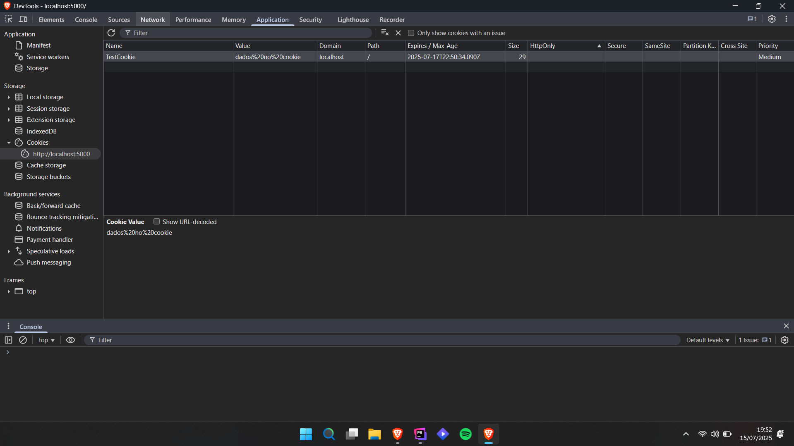

# INÍCIO
(Arquivo criado para anotar o que achar necessário durante meus estudos em PHP)
## **Rodar os arquivos**
### Temos duas maneiras:
### **Iniciando o servidor:**
- php -S localhost:3000 -t public

public é a pasta onde o servidor sera iniciado

### Rodando via terminal
- php arquivo.php

## **INCLUDE E REQUIRE DE ARQUIVOS**
```php
<?php
include './teste.php';

echo $name;
```
```php
<?php
require './teste.php';

echo $name;
```
### Qual a diferença?
include, caso não exista o arquivo requisitado, ele da erro, porém continua executando o programa, já no require, ele para a execução.

### include_once
Ele é chamado apenas uma vez, não importa quantas vezes é colocado o include no código, ou seja, você tem certeza que ele é chamado apenas uma vez.

### require_once
É a mesma coisa, porém quando houver um erro, ele apresenta apenas um erro.

## Variáveis
Temos 7 tipos:

string:
```php
gettype('aaa');
//retorno:
string
```
**É válido colocar variáveis entre chaves quando escritas dentro de strings.**
```php
$name = "Daniel";
$lastName = "Macedo";
$fullName = "{$name} {$lastName}";
```

numbers - integers
```php
gettype('aaa');
//retorno:
string
```
float(double)
```php
gettype(12.32);
//retorno:
double3
```
booleans
```php
gettype(true);
//retorno:
boolean
```
É bom deixar claro que booleano retorna 1 quando true e nada (null) quando falso.
arrays
```php
gettype(['aa', 12]);
//retorno:
array
```
object
```php
class Person{
}
echo gettype(new Person);
//retorno:
string
```
null
```php
gettype(null);
//retorno:
NULL
```
### Padrão de nome de variável
#### camelCase:
myName
  
#### snake_case:
my_name

## Ponteiro
Passa o valor como referência, a posição de memória da variável
```php
$myName = 'dan';
$name = &$myName;
$myName = 'joao';
echo $myName;
echo $name;
//output:
joaojoao
```

## Constantes

Por convenção, constantes são sempre definidas em maiúsculo

Definindo uma constante com "const" não funciona dentro de escopos, com "define" funciona.
ex:
```php
if(true){
    define("NAME", "dan");
}
echo NAME;
```
Isso mostra que constantes tem escopo global.


## MAGIC CONSTANTS

```php
__FUNCTION__
__METHOD__
__LINE__
__FILE__
```
É basicamente uma constante que altera o valor baseado no contexto, por exemplo o function e o method retornam o nome da função/método dela

O line retorna o número da linha que ela foi chamada.

O file retorna o diretório que o arquivo está.

Existem diversas constantes mágicas.

### Mais constantes

DIRECTORY_SEPARATOR

seria basicamente a "/"

#### verificar se uma constante existe
```php
if(defined('CONSTANTE_NAME')){

}
```
```php
$cons = get_defined_constants(true); //mostra todas as constantes definidas no php
var_dump($cons); //pega o conteúdo de uma variável
```

## Truthy e Falsy
Eles pegam valores reais e podem transformar em falso e verdadeiro, como:
```php
$nome = "dan";
echo !!$nome;

//vai retornar verdadeiro
```

### Falsy

Falsy são valores que se comportam como valores booleanos falsos, mas não são booleanos.
exemplos:
null

0

0.0

"0"

""

array()

## Truthy
Truthy é todo o resto

## Funções para string

strlen(); //tamanho da string

substr(); //separa uma string

str_contains(); //olha se contém algo na string

## Arredondar número

ceil(); //arredonda para cima

floor(); //arredonda para baixo

## Array

### Adicionar valores ao final de um array
array_push($array, elemento);

Essa função retorna um int com o tamanho do array

Se for adicionar apenas um elemento no array, utilize:
$array = elemento; para evitar overhead

### Adicionar valores ao início de um array

array_unshift();

### Array associativo
```php
$person = ['name' => 'dan', 'age' => 20];
//basicamente um array com chave valor
```
### Array multidimensional
```php
$person = 
[
    'name' => 'dan', 
    'age' => 20, 
    'documents' => [
        'cpf' => '112312321', 
        'rg' => '31231'
    ]
];
```

## Match (Condicional)

```php
$pessoa = "leo";

$returnValue = match ($pessoa) {
    "dan" => "essa pessoa é daniel",
    "joao" => "essa pessoa é joao",
    "caio", "leo" => "essa pessoa é caio ou leo",
    default => "essa pessoa nao ta aqui nao",
};
```
```php
$age = 18;

$output = match (true) {
    $age < 2 => "Baby",
    $age < 13 => "Child",
    $age <= 19 => "Teenager",
    $age >= 40 => "Old adult",
    $age > 19 => "Young adult",
};
```

O match é parecido com o switch, porém tem algumas diferenças:
- ele faz comparação forte (===) já o switch faz comparação fraca (==)
- match retorna um valor
- match não segue para os próximos cases igual o switch

Comparado ao switch, match é mais seguro uma vez que não necessitam de break e são mais conciso.

## Anonymous Function

```php

function teste($name){
    $person = function() use ($name){
      return $name;
    };
    return $person;
}

echo teste("dan")();
```
## Callbacks

São funções passadas como parâmetro para outras funções

Verificar realmente se é callback


is_callable($callback);

call_user_func();

## Super Globais

### $_COOKIE

Cookie é um valor guardado no navegador que é possível ser resgatado no sistema

Criar um cookie você coloca um prazo de validade nele, uma data limite

Dentro desse cookie é possível guardar diversos tipos de dados

É possível excluir um cookie manualmente

$_COOKIE para resgatar um cookie, qualquer cookie enviado do cliente ao servidor será guardado nessa 

setcookie(); Para criar um cookie

Cookies são parte do Header HTTP, então o setcookie() deve ser chamado antes qualquer output ser enviado para o navegador.

```php
$value = "dados no cookie";

setcookie(
  'TestCookie',
    $value,
    time() + (2*24*60*60)
);

//Mostra o conteúdo do cookie "TestCookie"
echo $_COOKIE["TestCookie"];

// visualizar todos os cookies
print_r($_COOKIE);
```

Se olhar a data, é possível ver que vai vencer em dois dias

**É possível usar também a função strtotime() para colocar a data de expiração.**

### Para verificar se um cookie está setado
```php
$cookieName = $_COOKIE["name"];
if(isset($cookieName)) {
    echo $cookieName;
} else{
    echo "{$cookieName} is not set";
}
```
Se o cookie não existir, ele também retorna um warning.

### Remover cookie

Para remover um cookie basta colocar o tempo negativo na parte de expiração, por exemplo:
```php
setcookie(
  'TestCookie',
    $value,
    strtotime('-2 days'),
);
```

## $_SESSION

Uma sessão também é guardada no navegador, diferente dos cookies que são guardados no computador do usuário, a sessão é guardada no servidor.

Quando uma sessão é iniciada, o PHP cria um identificador único para essa sessão e o envia ao navegador do usuário através de um cookie chamado "PHPSESSID".

É útil quando deseja guardar informação relacionada a uma sessão específica de usuário, como login, carrinho de compras, preferências de usuário, etc.

Para iniciar uma sessão, você deve chamar a função session_start() no início do seu script PHP. Isso cria ou retoma uma sessão existente.

Para salvar um valor numa sessão utilize $_SESSION['nome_da_sessao']

```php
session_start();
$_SESSION['username'] = 'Daniel';
//Daniel é o valor que será guardado na variável de sessão 'username'
```
```php
session_start();
if(!isset($_SESSION['count'])){
    $_SESSION['count'] = 0;
} else {
    $_SESSION['count']++;
}

echo $_SESSION['count'];
```
para excluir uma sessão específica:
```php
unset($_SESSION['name']);
```
Para excluir todas as sessões:
```php
session_destroy();
```

para criar um novo id:
```php
session_regenerate_id();
```

## $_ENV

Instalação:

Tudo está no github vlucas/phpdotenv

`composer require vlucas/phpdotenv` 

É importante criar um .env.example para demonstrar quais variáveis são necessárias (não atribuir valor real a essas variáveis)

O arquivo .env deve ficar dentro da pasta /public

É uma convenção colocar todas as letras maiúsculas nas variáveis de ambiente

um exemplo da .env

```
DATABASE=teste
HOST=localhost
PASSWORD=
USER=root
```
E como ficaria o .env.example

```
DATABASE=
HOST=
PASSWORD=
USER=
```

## $_FILES

### Pega um arquivo enviado de um formulário

Dentro de um formulário é possível criar um input do tipo file e é com o $_FILES que esse arquivo é recebido

## $_GET

Serve para poder pegar as variáveis do URL

ex: seusite.com.br?id=34&name=dan

id é a variável que é passada através da url do site

### Query string

Após a URL adicionamos o primeiro valor usando a seguinte sintaxe:

`?Chave=Valor`

Para concatenar demais valores, usa-se &

Ao dar um var dump no GET vai aparecer as variáveis da URI
`var_dump($_GET);`

Exemplo:

`http://localhost:5000/?id=32&email=teste@teste.com.br`

Vai retornar um array:
```php
array(2) {
  ["id"]=>
  string(2) "32"
  ["email"]=>
  string(18) "teste@teste.com.br"
}
```

### Sistema de busca

Para sistemas de busca, utilize o método GET

## $_POST

Serve para poder pegar os valores enviados através do header, ou seja, não é de uma maneira que todos podem ver igual ao get

## $_REQUEST

É possível pegar tanto uma query string quanto os valores passados através do header utilizando o post, logo, se quiser pegar tanto o get tanto o post utilize o request.

## $_SERVER

Consegue pegar o uri do site
seusite.com.br/teste
uri seria o /teste

Consegue pegar também a raiz do projeto

Pegar o tipo de requisição (GET ou POST)

Ao dar um var_dump é possível ver tudo o que consegue pegar do server:

`var_dump($_SERVER);`

Para identificar, por exemplo, se uma requisição é do tipo POST, você pode usar:

```php
if($_SERVER['REQUEST_METHOD'] === 'POST'){

}
```

## Arquivos do formulário

Sempre que trabalhar com arquivos em um formulário, usar "enctype="multipart/form-data"", caso não utilizar, nãos será possível enviar arquivos através de um formulário para outra página
```html
<form action="teste.php" method="post" enctype="multipart/form-data">
    <label for="File">Arquivo:</label>
    <input type="file" name="file" id="file" required>
    <button type="submit">Cadastrar</button>
</form>
```
```php
<?php

if($_SERVER["REQUEST_METHOD"] === "POST"){
    var_dump($_FILES);
}
```

## Composer

`composer init`

composer.json é onde estão os require do projeto

composer.lock trava as versões baixadas dos pacotes que tem na aplicação

A pasta vendor é onde o composer instala as dependências de terceiros e gera um autoload principal onde será importado no nosso arquivo principal da aplicação e ter acesso a todas as dependências listadas

`require '../vendor/autoload.php';`

A pasta vendor geralmente é descartável

Esse comando lê as dependências do composer.json e instala:

`composer install`

Para instalar apenas as dependências de produção:

`composer install --no-dev`

Para atualizar uma dependência de pacote:

`composer update`

Para instalar um pacote:

`composer require vlucas/phpdotenv`

- Se escrever apenas "composer require" é possível pesquisar uma lista de pacotes   
 
Para remover um pacote pelo nome:

`composer remove pacote/pacote`

## Sanitizadores e Validates

Filtros sanitize são para filtrar o que vai receber do formulário, evitando um ataque malicioso do usuário.

A função `filter_var()` é aplicada para sanitizar texto.

A função `filter_input()` é aplicada para sanitizar o input de um formulário.

```php
if($_SERVER["REQUEST_METHOD"] === "POST"){
    $name = filter_input(INPUT_POST, 'name', FILTER_SANITIZE_STRING);
    $email = filter_input(INPUT_POST, 'email', FILTER_SANITIZE_EMAIL);
}
```

Remove todos os caracteres exceto letras, dígitos e `!#$%&'*+-=``?^_{|}~@.[]`:

`FILTER_SANITIZE_EMAIL`


